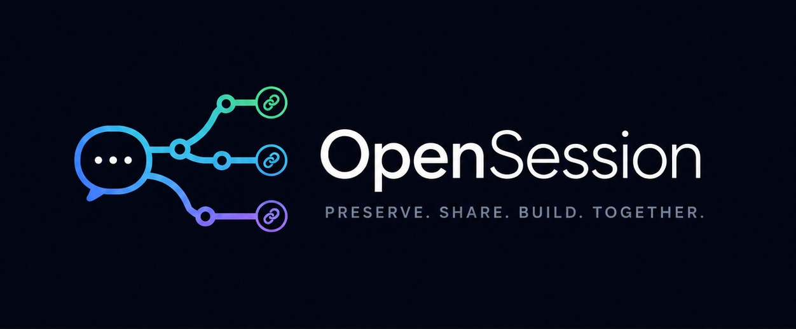

<p align="center">
  
</p>

# OpenSession

**A visualizer and social layer for [Open Session License](./OPEN-SESSION-LICENSE.md) artifacts** — the append-only `llm-turn-history.jsonl` session logs that open-session repos ship alongside their code.

Every project built in collaboration with an LLM under the Open Session License carries a complete, verbatim, append-only history of the human and machine turns that produced it. OpenSession makes those histories **legible, social, and comparable**:

## What it does

- **Realtime session feed.** Watch a live-updating feed of changes to `llm-turn-history.jsonl` files across the GitHub repos you've starred. See how projects are actually being built — turn by turn, human and model — as it happens.
- **Session visualization.** Render open-session-jsonl archives as readable, replayable conversations: speakers, timestamps, tool-activity summaries, identity attestations, and the `(ts, id)` merge order recovered across parallel branches.
- **Discussion threads.** Every session (and every turn) can anchor a chat thread where users discuss what happened, make suggestions, and critique prompting or model behavior.
- **Cross-model evals.** Run the same session prompts through different models and compare — the license's "epistemic self-defense" goal made concrete. See evals attached to sessions in the feed.
- **Linked identity: GitHub ⇄ X.** Users connect their GitHub account and link their X (Twitter) identity. Once linked:
  - GitHub contributions are shown as the X users who made them.
  - Any user can DM any other linked user on X — powered by [xChatHub](./xChatHub) (an in-page Chrome extension that drives X's own DM client, including E2E-encrypted XChat threads).

## Why session data matters

You don't read code anymore. Most of a project is now written by a model, and the part that carries the *intent* — why a thing exists, what was tried and rejected, the constraint that shaped a decision — lives in the session, not the diff. Delete the session and you keep the artifact but lose the reasoning that produced it.

That reasoning is also the highest-value context for the *next* model. The prompts, tool calls, and dead ends you produced building something last year are exactly what a stronger model would need to rebuild it better today — if you still have them. Right now that context mostly evaporates, or is retained privately by the big model providers and never handed back to you. OpenSession's bet: **keep your session logs, and for open source, share them with the community** — so intent stays legible, work stays reproducible, and the accumulated context of how software gets built with AI belongs to the people building it, not only to the labs.

## Desktop app

[`desktop/`](./desktop) is an Electron app that turns your starred repos' `llm-turn-history.jsonl` logs into a Slack-style workspace and adds a realtime bridge between the people behind the code — **GitHub for what happened, X for who's talking about it.**

- **Sessions as channels.** Each starred repo carrying a history file appears in the sidebar; every declared session is a `#channel`; turns render as a chat stream (speaker, model badge, timestamps, tool-activity). Parsing is shared verbatim with the web app, so both surfaces read archives identically.
- **Discussion on any turn.** Hover a turn to open a discussion; existing threads show as chips. The right rail hosts the global thread list, a thread's posts with replies and votes, and the composer — a Reddit-style layer anchored to individual turns.
- **GitHub ⇄ X bridge.** Contributors link their GitHub identity to their X (Twitter) handle, so the humans behind each turn are reachable — realtime visibility into who built what, and direct communication about it between X accounts, without leaving the session.
- **Live updates.** Polls each followed repo's history file; new turns flash the channel and accrue per-session unseen badges, so an active build reads like a live conversation.
- **Pre-publish leak scan.** Before you share or reshare a session, [`scan/leakscan.mjs`](./desktop/scan/leakscan.mjs) detects provider-encrypted reasoning envelopes and residual secrets/PII and offers a sanitized copy — the defensive answer to the [stolen-thoughts](https://stolen-thoughts.com/paper.pdf) attack, where encrypted reasoning blocks in public logs were decoded to recover credentials and PII. You can't sanitize what you can't read; OpenSession strips it first.
- **Turn benchmarks.** Score every turn in a repo (structure integrity, turn stats, a delusion heuristic) locally, in a disposable **Daytona** sandbox for clean-room provenance, or via a **RocketRide** Cloud pipeline whose grounded LLM judge turns a flagged turn into a confirmed/refuted verdict. Reports export as `opensession-bench-report/v0`.

```bash
cd desktop
npm install
npm start        # builds, then launches the Electron app
```

Roadmap: publishing bench reports to the registry, and **peer-to-peer verification** — your worker benches a peer's flagged sessions against bespoke LoRA-trained models running in the cloud (RocketRide + Daytona), earning priority for your own, BitTorrent-style, with the registry as tracker.

## Components

| Piece | Role |
|---|---|
| [`OPEN-SESSION-LICENSE.md`](./OPEN-SESSION-LICENSE.md) | The license and the `open-session-jsonl` wire format this app visualizes (pulled from [InfiniteMirror](https://github.com/oceanseth/InfiniteMirror)) |
| [`xChatHub/`](https://github.com/oceanseth/xChatHub) | X DM layer — keyboard-first DM client + WebMCP tools + localhost MCP bridge; the transport for user-to-user messaging |
| [`desktop/`](./desktop) | Electron desktop app — Slack-style session workspace, turn discussions, live updates, pre-publish leak scanner, and Daytona/RocketRide turn benchmarks |
| `llm-turn-history.jsonl` | This repo's own session history — OpenSession is itself built under the Open Session License |

## Development

The web app lives in [`app/`](./app) — Vite + React + TypeScript (views are kept presentational so they can be reused in a future React Native mobile app):

```bash
git clone --recurse-submodules https://github.com/oceanseth/OpenSession
cd OpenSession/app
npm install
npm run dev    # local dev server
npm test       # vitest (open-session-jsonl parser tests)
npm run build  # production build → dist/
```

`main` is tested locally only. Pushing to the **`production`** branch deploys to
**<https://opensession.groupnetwork.com>** via GitHub Actions
([`.github/workflows/deploy.yml`](./.github/workflows/deploy.yml)): OIDC-assumed IAM role →
build → S3 (`opensession.groupnetwork.com`) → CloudFront (`E1ECGJB4KUGGL5`) invalidation.
DNS is a Route53 alias on the `groupnetwork.com` zone.

## GitHub OAuth

Sign-in uses a GitHub OAuth App (web flow). The SPA redirects to GitHub, and the
`opensession-auth` Lambda (behind API Gateway `r1q8b3li40`, endpoint
`https://r1q8b3li40.execute-api.us-east-1.amazonaws.com/token`) exchanges the callback code
for a token — the client secret never reaches the browser. The client ID is injected at build
time via `VITE_OAUTH_CLIENT_ID` (repo Actions variable `OAUTH_CLIENT_ID`); when unset, the
sign-in button is hidden and the personal-access-token flow still works.

To (re)configure credentials:

```bash
# after creating the OAuth App at github.com/settings/applications/new
# (callback URL: https://opensession.groupnetwork.com/)
aws lambda update-function-configuration --function-name opensession-auth --region us-east-1 \
  --environment "Variables={GH_CLIENT_ID=<id>,GH_CLIENT_SECRET=<secret>}"
gh variable set OAUTH_CLIENT_ID -b <id> -R oceanseth/OpenSession
```

For local dev, the simplest path is the PAT flow (leave `VITE_OAUTH_CLIENT_ID` unset). Full
OAuth locally needs a second OAuth App with callback `http://localhost:5173/` — its id goes in
`app/.env.local`, and the Lambda's env must temporarily hold that app's id/secret, since it
can only serve one OAuth App at a time.

## Registry & follows

Discovery is backed by a hosted registry (`server/index.mjs` — the `opensession-api` Lambda on
API Gateway `r1q8b3li40` under `/api`, DynamoDB `opensession-repos` / `opensession-follows` /
`opensession-authcache`, SQS `opensession-verify`) so users never probe thousands of starred
repos against GitHub themselves:

- **Canonical key is the GitHub numeric repo id.** The registry caches which repos implement
  the Open Session License; checks are **server-side** (a `HEAD` on the raw history file) and
  **demand-driven** — repos are (re)verified only when users surface them, at most once daily
  per repo (no global sweeps).
- `POST /api/repos/match` — client sends its starred repos (`[{id, full_name}]`); server
  returns the known implementers and queues unknown/stale ones for verification.
- `POST /api/repos/submit` — follow any repo by `owner/name` or URL; resolved with the
  caller's token, verified inline, auto-followed.
- `GET/PUT/DELETE /api/follows…` — the user's curated follow list (following is opt-in per
  repo, not forced for every starred match). Auth is the user's GitHub token, resolved to
  their GitHub user id server-side (cached ~1h).

The client scans stars in 1,000-repo windows (newest first, "scan more" for deeper history)
and live-polls only *followed* repos for new turns.

## Status

Working: the live follow feed, starred-repo discovery via the shared registry, GitHub OAuth
sign-in, the session visualizer, and the discussion-thread API. The **desktop app** adds the
Slack-style session workspace, turn-level discussions, live updates, the pre-publish leak
scanner, and turn benchmarks (local / Daytona / RocketRide). Next up: X identity linking via
xChatHub attestation across web and desktop, publishing bench reports to the registry, and the
peer-to-peer verification network.

## License

Code is MIT (see `LICENSE`, forthcoming). Session-transparency conditions per the [Open Session License](./OPEN-SESSION-LICENSE.md) apply: the history file is append-only, propagates to forks, and is never loaded as machine context.
